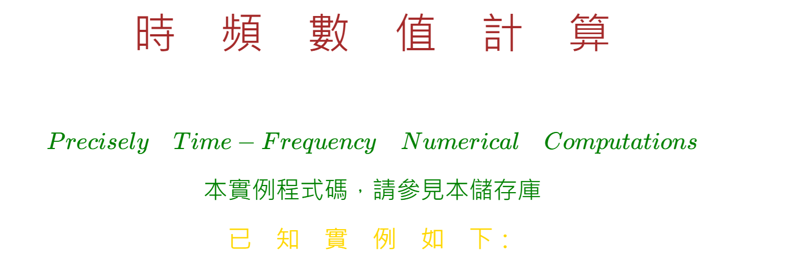
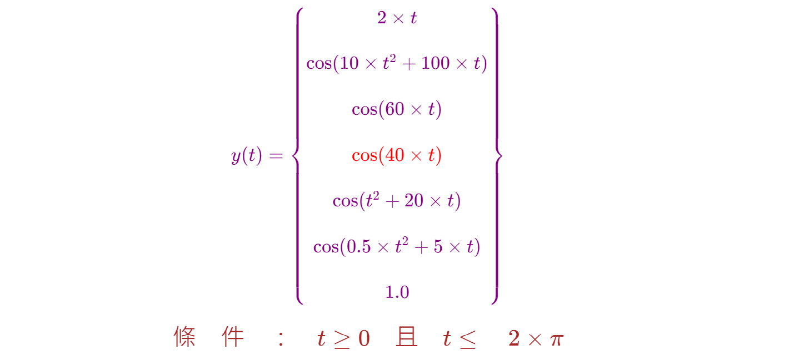
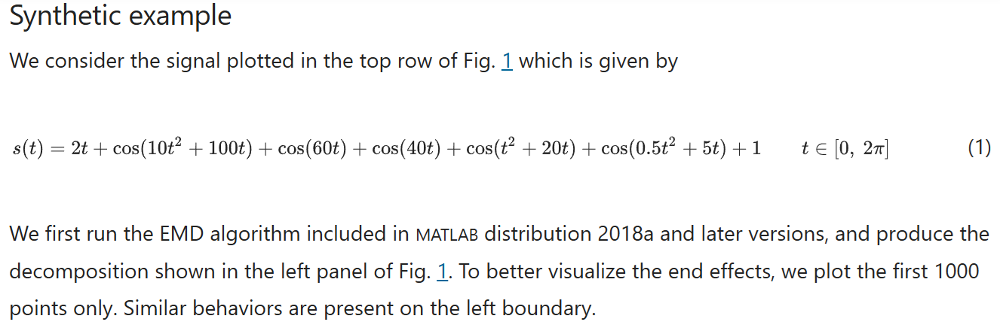

<!--     範例 App_51  Markdown         -->

### 
<!--                 
# \[{  \color{Fuchsia}精\;銳\; \color{Purple}矩\;陣\;  \color{Red}計\;算\; \color{Green} 求\;解\;器  }\] 
-->  
 

<!--         
#### \[{  \color{Fuchsia} 【 \color{Green}  Sharp \; Matrix \; Solver \;  \color{Brown} \iff  \;  \color{Red} S\;M\;S】 }\]  
-->  
  

---

<!--   
## \[{ \color{Fuchsia} Time-Frequency-Signal \;(Response) \quad Solution  }\] 
-->
  

<!--     ##### \[ using \]   -->
  
<!--    ##### $$using$$   -->  

<!--   
## \[  \color{Red} Precisely \; Numerical \; Value \; Computations  \]  
-->  
  

<!--     ##### \[ with \]   -->  
  
<!--   ##### $$with$$  -->  

<!--   
## \[{ \color{Green} Real \; \color{Red} And \; \color{magenta} Complex \quad \; \color{Brown} Matrix \;\; Transform  }\] 
-->
  

<!--         ##### \[ Part \; 1 \]    -->  
<!--         -->  
<!--     ##### $$Part \quad 3$$    -->  

####

---  

<!--      
# \[{ \color{Brown} 時 \quad 頻 \quad 數\quad 值\quad 計 \quad 算 }\]  

#### \[{ \color{Green}  Precisely \quad Time-Frequency \quad Numerical \quad Computations }\]  

#### \[{ \color{Green} 本實例程式碼，請參見本儲存庫   }\]  

#### \[{ \color{Gold} 已 \quad 知 \quad實 \quad 例 \quad 如 \quad 下 ：}\]
-->  
  

<!--      
##### \[{ \color{Purple} y(t) = \begin{Bmatrix} 2 \times t \\\\ \cos(10 \times t^2 + 100 \times t) \\\\ \cos(60 \times t) \\\\ \color{Red}{ \cos(40 \times t) } \\\\ \cos(t^2 + 20 \times t)  \\\\ \cos(0.5 \times t^2 + 5 \times t) \\\\ 1.0 \end{Bmatrix} }\]  

#### \[{ \color{Brown} 條 \quad 件 \quad ： \quad t \geq 0 \quad 且 \quad t \leq \quad 2 \times \pi }\]
-->
  

## [參見 : https://www.nature.com/articles/s41588-020-72193-2](https://www.nature.com/articles/s41598-020-72193-2)  

##  https://www.nature.com/articles/s41598-020-72193-2

<!--       
# \[{ \color{Olive} 結\quad論\quad如\quad下：}\]  
-->
  

### **1...訊號輸出響應值y，參見本儲存庫"時間與振幅圖.pnd"檔案。**

### **2...已知角頻率是時間的變數(Time Variant)。**

### **3...參見App_48儲存庫，由矩陣微分方程式，求得實數系統矩陣A，再求得複數特徵矩陣D，和複數模態矩陣Q。**  

### **4...本實例的頻率為已知，係人為自行設定的餘弦和時間的函數，雖然隨時間而變化，但不是狀態空間方程式(State Space Representation)。**  

### **5...無需使用Hexp(D, Q, t)轉換矩陣求解，因為響應值y(t)設定為已知時變數(Time Variant)。**

### **6...求得多個不同狀態變數的響應值，參見App_6J ... App_48儲存庫中的程式碼**

###

  

---
