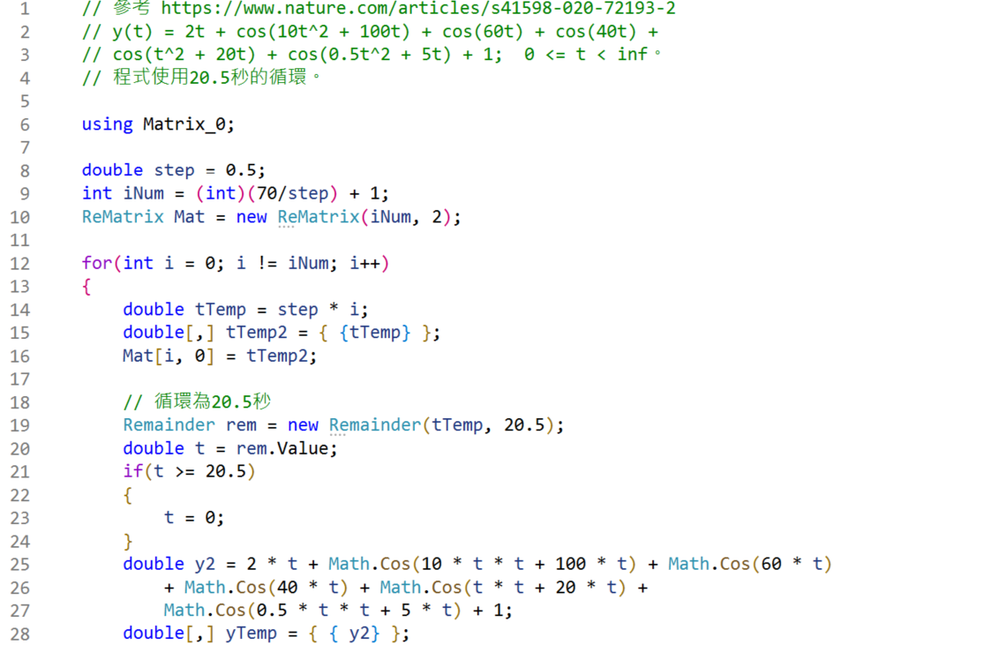
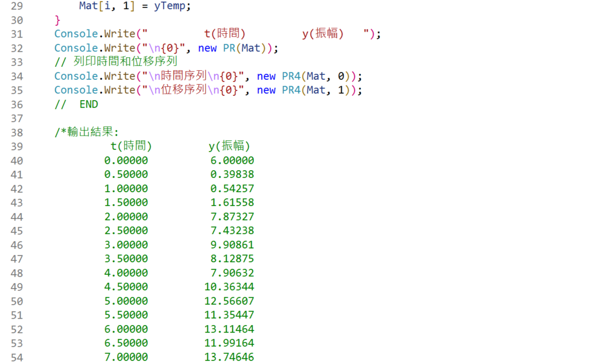

<!--     範例 App_51  Markdown         -->

### 
<!--                 
# \[{  \color{Fuchsia}精\;銳\; \color{Purple}矩\;陣\;  \color{Red}計\;算\; \color{Green} 求\;解\;器  }\] 
-->  
 


<!--         
#### \[{  \color{Fuchsia} 【 \color{Green}  Sharp \; Matrix \; Solver \;  \color{Brown} \iff  \;  \color{Red} S\;M\;S】 }\]  
-->  
  

---

<!--   
## \[{ \color{Fuchsia} Time-Frequency-Signal \;(Response) \quad Solution  }\] 
-->
  

<!--     ##### \[ using \]   -->
  
<!--    ##### $$using$$   -->  

<!--   
## \[  \color{Red} Precisely \; Numerical \; Value \; Computations  \]  
-->  
  

<!--     ##### \[ with \]   -->  
  
<!--   ##### $$with$$  -->  

<!--   
## \[{ \color{Green} Real \; \color{Red} And \; \color{magenta} Complex \quad \; \color{Brown} Matrix \;\; Transform  }\] 
-->
  

<!--         ##### \[ Part \; 1 \]    -->  
<!--         -->  
<!--     ##### $$Part \quad 3$$    -->  

####

---  

<!--      
# \[{ \color{Brown} 時 \quad 頻 \quad 數\quad 值\quad 計 \quad 算 }\]  

#### \[{ \color{Green}  Precisely \quad Time-Frequency \quad Numerical \quad Computations }\]  

#### \[{ \color{Green} 本實例程式碼，請參見本儲存庫   }\]  

#### \[{ \color{Gold} 已 \quad 知 \quad實 \quad 例 \quad 如 \quad 下 ：}\]
-->  
  

<!--      
##### \[{ \color{Purple} y(t) = \begin{Bmatrix} 2 \times t \\\\ \cos(10 \times t^2 + 100 \times t) \\\\ \cos(60 \times t) \\\\ \color{Red}{ \cos(40 \times t) } \\\\ \cos(t^2 + 20 \times t)  \\\\ \cos(0.5 \times t^2 + 5 \times t) \\\\ 1.0 \end{Bmatrix} }\]  

#### \[{ \color{Brown} 條 \quad 件 \quad ： \quad t \geq 0 \quad 且 \quad t \leq \quad 2 \times \pi }\]
-->
  

## [參見 : https://www.nature.com/articles/s41588-020-72193-2](https://www.nature.com/articles/s41598-020-72193-2)  


##  https://www.nature.com/articles/s41598-020-72193-2






```CSharp
// 參考 https://www.nature.com/articles/s41598-020-72193-2 
// y(t) = 2t + cos(10t^2 + 100t) + cos(60t) + cos(40t) + 
// cos(t^2 + 20t) + cos(0.5t^2 + 5t) + 1;  0 <= t < inf。
// ***   但程式使用20.5秒的循環  ***  

using Matrix_0;

double step = 0.5; 
int iNum = (int)(70/step) + 1; 
ReMatrix Mat = new ReMatrix(iNum, 2); 

for(int i = 0; i != iNum; i++)
{
    double tTemp = step * i;
    double[,] tTemp2 = { {tTemp} };
    Mat[i, 0] = tTemp2;

    // 循環為20.5秒
    Remainder rem = new Remainder(tTemp, 20.5);
    double t = rem.Value;
    if(t >= 20.5)
    {  
        t = 0;  
    }
    double y2 = 2 * t + Math.Cos(10 * t * t + 100 * t) + Math.Cos(60 * t) 
        + Math.Cos(40 * t) + Math.Cos(t * t + 20 * t) + 
        Math.Cos(0.5 * t * t + 5 * t) + 1;
    double[,] yTemp = { { y2} }; 
    Mat[i, 1] = yTemp;
}
Console.Write("         t(時間)         y(振幅)   ");
Console.Write("\n{0}", new PR(Mat));
// 列印時間和位移序列
Console.Write("\n時間序列\n{0}", new PR4(Mat, 0));
Console.Write("\n位移序列\n{0}", new PR4(Mat, 1));
//  END 

/*輸出結果:
         t(時間)         y(振幅)
        0.00000          6.00000
        0.50000          0.39838
        1.00000          0.54257
        1.50000          1.61558
        2.00000          7.87327
            .
            .
            .
            .
       69.00000         15.53975
       69.50000         15.97251
       70.00000         17.17767

時間序列
   0.0000,    0.5000,    1.0000,    1.5000,    2.0000,
   2.5000,    3.0000,    3.5000,    4.0000,    4.5000,
            .
            .
            .
            .
  55.0000,   55.5000,   56.0000,   56.5000,   57.0000,
  57.5000,   58.0000,   58.5000,   59.0000,   59.5000,
  60.0000,   60.5000,   61.0000,   61.5000,   62.0000,
  62.5000,   63.0000,   63.5000,   64.0000,   64.5000,
  65.0000,   65.5000,   66.0000,   66.5000,   67.0000,
  67.5000,   68.0000,   68.5000,   69.0000,   69.5000,
  70.0000,

位移序列
   6.0000,    0.3984,         0.5426,         1.6156,         7.8733,
   7.4324,    9.9086,         8.1288,         7.9063,        10.3634,
  12.5661,   11.3545,        13.1146,        11.9916,        13.7465,
  15.5397,   15.9725,        17.1777,        18.4677,        18.4684,
            .
            .
            .
            .
   0.5426,    1.6156,         7.8733,         7.4324,         9.9086,
   8.1288,    7.9063,        10.3634,        12.5661,        11.3545,
  13.1146,   11.9916,        13.7465,        15.5397,        15.9725,
  17.1777,
*/
```


<!--       
# \[{ \color{Olive} 結\quad論\quad如\quad下：}\]  
-->
  

### **1...訊號輸出響應值y，參見本儲存庫"時間與振幅圖.pnd"檔案。**

### **2...已知角頻率是時間的變數(Time Variant)。**

### **3...參見App_48儲存庫，由矩陣微分方程式，求得實數系統矩陣A，再求得複數特徵矩陣D，和複數模態矩陣Q。**  

### **4...本實例的頻率為已知，係人為自行設定的餘弦和時間的函數，雖然隨時間而變化，但不是狀態空間方程式(State Space Representation)。**  

### **5...無需使用Hexp(D, Q, t)轉換矩陣求解，因為響應值y(t)設定為已知時變數(Time Variant)。**

### **6...求得多個不同狀態變數的響應值，參見App_6J ... App_48儲存庫中的程式碼**

###


  

---
